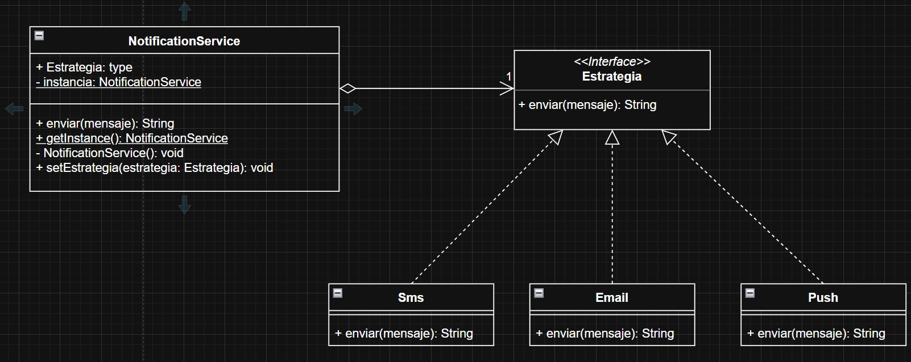

# Ejercicios semana 2
# Primer ejercicio
## 1.Identificar
### Nombre del patron
- Strategy y Singleton
### Tipo del patron
- de comportamiento y creacional
### Justificacion Tecnica
- el ejercicio pide que exista una unica instancia de cada mensaje
y a su vez pide que tengan distintos comportamientos segun que se cree
por eso elegi Strategy y Singleton (ademas que me queria distanciar
un poco del ejercicio que ya se habia hecho y practicar otro patron)

## 2. Realizar diagrama UML

